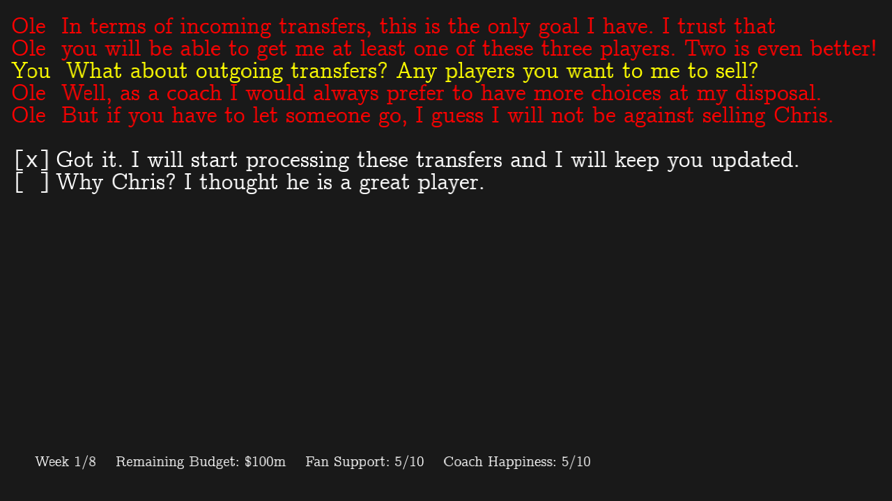

# Transfer Saga

Author: Zhengyang Xia

Design: The player plays the role of the director of a top football club and experiences the
various decisions he has to face during a transfer window. Trying to keep the coach, the fans
and the board happy is not an easy task!

Text Drawing: Text is rendered at runtime. TrueType fonts are loaded and processed with harfbuzz into glyphss.

Screen Shot:

How To Play:

Use up and down keys to move the cursor. Use Enter to select options. During the course of text
animation, use Enter to skip animation and display all the text. Press ESC to quit the game.

Sources:
Text Drawing code is based on the code by [Xiaoqiao Xu and Fengying Yang](https://github.com/xuxiaoqiao/game-marios) 
Font used is [Computer Modern](https://en.wikipedia.org/wiki/Computer_Modern) and [IBM Plex Mono](https://fonts.google.com/featured/Plex)

This game was built with [NEST](NEST.md).

